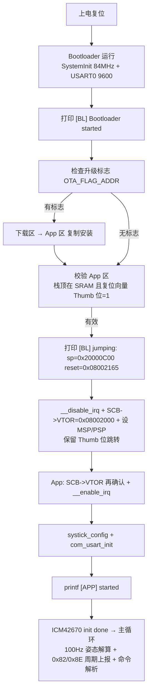

# GD32F330 OTA Bootloader 跳转调试总结

## 一、背景与结论

- 芯片：**GD32F330**（Cortex-M4 @84MHz，128KB Flash，16KB SRAM）。
- 目标：实现 **Bootloader + App 双程序**，Bootloader 上电检查并跳转到 App；最终打通 OTA 闭环（0xF0 开始 → 0xF1 分包 → 0xF2 结束 → 重启自动安装）。
- **结论：跳转链路已打通并验证**——上电后串口依次输出 `[BL] Bootloader started` → `[BL] jumping: sp=... reset=...` → `[APP] started` → `ICM42670 init done`，App 正常跑起来、姿态解算正常、业务命令收发正常。

### 1.1 Flash 分区布局

| 分区 | 起始地址 | 大小 | 说明 |
|---|---|---|---|
| Bootloader | `0x08000000` | 8KB | 上电先运行，负责检查升级标志并跳转 |
| App 运行区 | `0x08002000` | 28KB | 姿态解算主程序（当前固件运行位置） |
| 下载区 | `0x08009000` | 28KB | OTA 临时存放新固件 |
| 数据分区 | `0x08010000` | 64KB | YAW/报警/零点等数据，OTA 不触碰 |

> App 链接在 `0x08002000`（`.uvprojx` 中 IROM 用户值 = `0x08002000, 0x7000`）。
> 实测 App `__initial_sp=0x20000C00`（栈 0x20000800 起 1KB）、`Reset_Handler=0x08002164`（带 Thumb 位即 `0x08002165`）。

### 1.2 跳转原理（是什么 / 怎么做 / 为什么）

- **是什么**：Bootloader 用串口/Flash 检查完后，把 CPU 控制权交给 App。类比电脑 BIOS → 操作系统。
- **怎么做**：读 App 区向量表前两个字段（栈顶 `app_sp` + 复位向量 `app_pc`）→ 关中断 → 把 `SCB->VTOR` 指到 App 区 → 设置 MSP/PSP → `BLX` 跳转到 App 的 Reset Handler。
- **为什么**：Cortex-M 复位后靠向量表启动；App 与 Bootloader 的中断向量表不同，必须重定位 VTOR，否则中断会跳到 Bootloader 的向量表去。

```c
static void jump_to_app(void) {
    uint32_t app_sp = *((volatile uint32_t *)APP_START_ADDR);
    uint32_t app_pc = *((volatile uint32_t *)(APP_START_ADDR + 4));
    __disable_irq();                       // 跳转过程中不许来中断
    SCB->VTOR = APP_START_ADDR;            // 向量表重定向到 App
    __set_MSP(app_sp);                     // 设置 App 的栈指针
    __set_PSP(app_sp);
    /* 关键：保留 Thumb 位（app_pc 最低位=1），Cortex-M 只支持 Thumb 指令 */
    void (*jump)(void) = (void (*)(void))app_pc;
    jump();                                // 跳到 App 的 Reset Handler
}
```

---

## 二、出现的问题、怀疑与解决方式

| # | 问题现象 | 怀疑方向 | 解决方式 |
|---|---|---|---|
| 1 | 跳转后立即 HardFault，连 `[APP] started` 都打不出 | 跳转时把复位向量的 Thumb 位清了（`app_pc & ~1U`），BLX 进 ARM 状态 | **保留 Thumb 位**：直接 `(void (*)(void))app_pc`，去掉 `& ~1U` |
| 2 | 跳转后卡死，SystemInit 里 PLL 等待位永不置位 | 热跳转时 App 的 SystemInit 重新配 PLL，与 Bootloader 已配好的时钟打架 | **加 SCSS==PLL 判断**：时钟已是 PLL 时跳过重配 |
| 3 | `delay_1ms` 卡死、主循环不转 | Bootloader 跳转前 `__disable_irq()` 关了全局中断，App 没恢复 | App 的 `main()` 第一行 `__enable_irq()` |
| 4 | SysTick 中断不进、延时永远不走 | `gd32f3x0_it.c` 没加进 APP 目标，SysTick_Handler 用的是启动文件里的弱默认（死循环 `B .`） | 把 `gd32f3x0_it.c` 加入 APP 目标（Keil 界面加文件） |
| 5 | printf 触发 HardFault：`HFSR=0x80000000`（DEBUGEVT=BKPT 0xAB） | 标准库 printf 默认走**半主机**（semihosting），离开调试器没人应答 BKPT | `#pragma import(__use_no_semihosting)` + 自定义 fputc |
| 6 | 链接报 `L6915E: __use_no_semihosting was requested, but a semihosting fputc was linked in` | 加了禁半主机后，工程里没有用户 fputc（原来提供 fputc 的文件被移走了） | 在 `main.c` 提供自定义 `fputc`（发到 USART0） |
| 7 | 串口收命令无回复（业务命令被吞） | 主循环按**帧头 0xAA** 分流，但业务协议与 OTA 协议上行帧头都是 0xAA | 改成**按功能码分流**：`buffer[2] >= 0xF0` 走 OTA，否则走业务 `proto_send` |

---

## 三、问题详解

### 3.1 问题 1：Thumb 位被清 → 跳转即 HardFault

- **现象**：跳转后程序直接 HardFault，串口毫无输出。
- **根因**：跳转代码里写了 `(uint32_t)(app_pc & ~1U)`，把复位向量的**最低位（Thumb 位）清成 0**。
- **原理**：Cortex-M 只执行 **Thumb 指令**。`BLX/BX` 会用目标地址的最低位来判断状态——最低位=1 才是 Thumb 状态。复位向量里存的 `0x08002164` 只是指令地址，执行时必须是 `0x08002165`（奇数）。清掉最低位 → CPU 以 ARM 状态解释 Thumb 指令 → 立即 HardFault。
- **解决**：跳转直接用 `(void (*)(void))app_pc`，保留 Thumb 位。`is_app_valid()` 里也加了校验：`(app_pc & 1U) == 0` 视为无效。

### 3.2 问题 2：App 的 SystemInit 重配 PLL 卡死（热跳转时钟冲突）

- **现象**：跳转进了 App，但卡在 `system_gd32f3x0.c` 的时钟配置里，`while(0U == (RCU_CFG0 & RCU_SCSS_PLL))` 永远等不到。
- **根因**：Bootloader 运行后时钟已经是 PLL（84MHz）。App 启动时 startup 文件会调用 `SystemInit()` **再配一遍 PLL**——但此时 PLL 已经使能且是系统时钟源，重新切源/改倍频会让 PLL 停在"未就绪"状态，等待位永远不置位。
- **解决**：把时钟重配包在判断里，已经是 PLL 就跳过：

```c
if ((RCU_CFG0 & RCU_CFG0_SCSS) != RCU_SCSS_PLL) {
    /* 只有时钟还不是 PLL 才重新配置（热跳转时跳过） */
    ... PLL 配置 ...
}
```

### 3.3 问题 3：全局中断被 Bootloader 关了 → 延时卡死

- **现象**：`[APP] started` 能打出，但 `delay_1ms()`/`delay_ms()` 死循环。
- **根因**：`jump_to_app()` 调了 `__disable_irq()` 关全局中断（防止跳转过程来中断），跳转后 App 没恢复。SysTick 中断永远不触发 → `delay_decrement()` 永不执行 → 延时函数卡死。
- **解决**：App 的 `main()` 第一行加 `__enable_irq()`：

```c
int main(void) {
    SCB->VTOR = 0x08002000U;   /* 向量表重定位 */
    __enable_irq();            /* 恢复被 bootloader 关掉的全局中断 */
    systick_config();
    com_usart_init();
    printf("[APP] started\r\n");
    ...
}
```

### 3.4 问题 4：缺 gd32f3x0_it.c → SysTick_Handler 是弱默认死循环

- **现象**：延时仍然不走，或系统"假死"。
- **根因**：`SysTick_Handler` 由 `gd32f3x0_it.c` 提供（调用 `delay_decrement`）。该文件没加进 APP 目标时，链接器用了**启动文件里的弱默认实现**——一个 `B .` 死循环，中断进来就出不去。
- **解决**：在 Keil 的 APP 目标里把 `gd32f3x0_it.c` 加进编译（该文件还含 USART0 空闲中断、TIMER1 等 Handler）。

### 3.5 问题 5：printf 半主机 HardFault

- **现象**：跑到 printf 就 HardFault，`HFSR=0x80000000`（DEBUGEVT）、`CFSR=0`。
- **根因**：标准 C 库的 printf 默认走**半主机（semihosting）**——执行 `BKPT 0xAB` 请求调试器服务。有仿真器时字进 Keil 的 "Debug (printf) Viewer"；**没调试器连接时没人应答 → 直接 HardFault**。
- **解决**：禁半主机 + 自己提供 fputc（见问题 6）。

### 3.6 问题 6：L6915E — 没有用户 fputc

- **现象**：链接报 `L6915E: __use_no_semihosting was requested, but a semihosting fputc was linked in`。
- **根因**：`#pragma import(__use_no_semihosting)` 让链接器**禁止 C 库的半主机版 fputc**，并要求用户提供一个 fputc。原来提供 fputc 的 `gd32f350r_eval.c`（官方评估板文件，`fputc` 发到 `EVAL_COM=USART0`）在做 OTA 重构时被移出工程，之后 `bootloader.c` 也移出了 APP 目标 → 工程里没有任何用户 fputc。
- **解决**：在 `main.c` 里提供自定义 fputc（发到 USART0，9600 波特率）：

```c
#pragma import(__use_no_semihosting)
struct __FILE { int handle; };
FILE __stdout;
void _sys_exit(int x) { x = x; }
void _ttywrch(int ch) { (void)ch; }

int fputc(int ch, FILE *f) {
    usart_data_transmit(USART0, (uint8_t)ch);
    while (RESET == usart_flag_get(USART0, USART_FLAG_TBE));
    return ch;
}
```

> 为什么不用 MicroLIB？MicroLIB 的 printf **不支持 `%f` 浮点打印**，本项目角度打印需要 `%.2f`，所以保留标准库 + 禁半主机。注意工程里 `useUlib=1`（MicroLIB 目前是开着的），`main.c` 里的 `%f` 打印目前都注释着；若以后要用 `%f`，需关掉 MicroLIB。
> 关于"以前 printf 能走串口"：以前是 `gd32f350r_eval.c` 的 fputc 在提供重定向（`EVAL_COM=USART0`），不是编译器自动的。那个文件被移走后，main.c 的 fputc 就是它的替代品。

### 3.7 问题 7：串口收命令无回复（业务/OTA 帧路由冲突）

- **现象**：上位机发 `AA 03 89 00 75`（读预警时间），设备只回周期上报的心跳（`55 06 8E...`）和角度（`55 0F 82...`），**没有 0x89 的回复**。
- **根因**：`main.c` 主循环原来按**帧头分流**：

```c
if (usart0_rx_buffer[0] == 0xAA) {   // ❌ 业务与 OTA 上行帧头都是 0xAA
    ... ota_protocol_parse(...)      // 0x89 被当成 OTA 帧吞掉
} else {
    ... proto_send(...)
}
```

- **原理**：业务协议（0x82~0x8E）和 OTA 协议（0xF0~0xF3）的**上行帧头都是 0xAA**。帧头只是"方向"标记（0xAA=收、0x55=发），不是"协议"标记。按帧头分流会把业务命令喂给只认 0xF0~0xF3 的 OTA 解析器，直接被忽略。
- **解决**：改成**按功能码分流**：

```c
uint8_t rx_cmd = usart0_rx_buffer[2];
if (rx_cmd >= 0xF0) {                // ✅ 0xF0~0xF3 走 OTA
    for (uint16_t i = 0; i < usart0_rx_len; i++)
        ota_protocol_parse(usart0_rx_buffer[i]);
} else {                             // 0x82~0x8E 走业务
    uint8_t calc_cs = calc_checksum(usart0_rx_buffer + 1, usart0_rx_len - 2);
    if (calc_cs == usart0_rx_buffer[usart0_rx_len - 1])
        proto_send(usart0_rx_buffer[2]);   // 校验通过才执行
}
```

---

## 四、当前跳转流程



---

## 五、排障方法学

1. **从"最靠近跳转处"开始分点定位**：先确认 Bootloader 能打印 → 再确认跳转那一刻的 sp/reset 值 → 再确认 App 能打印哪一行，就能精确锁定卡在哪一环。
2. **串口分阶段标记**：在 Bootloader、跳转、SystemInit、main 入口、各外设初始化处打印不同标记，看"最后一个出现的标记"判断卡死位置。
3. **寄存器现场**：HardFault 后读 `HFSR`/`CFSR`/`BFAR`/`MMFAR`——`HFSR.DEBUGEVT=1` 且 `CFSR=0` 基本就是半主机 BKPT；同时看 PC/LR 定位崩溃指令。
4. **分清"真实编译错误"与"IDE 误报"**：VS Code 的 C/C++ 智能提示没配 Keil 头文件路径会报一堆 `file not found`/类型未定义——以 Keil ARMCC 实际编译结果为准。
5. **改动一次、验证一次**：7 个问题层层叠加，每个修完都要重烧验证，避免多个变量混在一起无法判断。

---

## 六、验证成功的串口日志（最终形态）

```
[BL] Bootloader started
[BL] jumping: sp=0x20000C00 reset=0x08002165
[APP] started
ICM42670 init: via soft-I2C ...
ICM42670 init done
got id: 0x80
[YAW-FLASH] load SKIP page empty (first boot)
```

- 无 HardFault、无卡死；业务命令（如 `AA 03 89 00 75`）能收到对应 `55 ...` 回复。
- 下一步：验证 **OTA 闭环**（0xF0 开始 → 0xF1 每包 512B 写入 → 0xF2 结束+总校验 → 重启后 Bootloader 自动安装到 App 区）。
