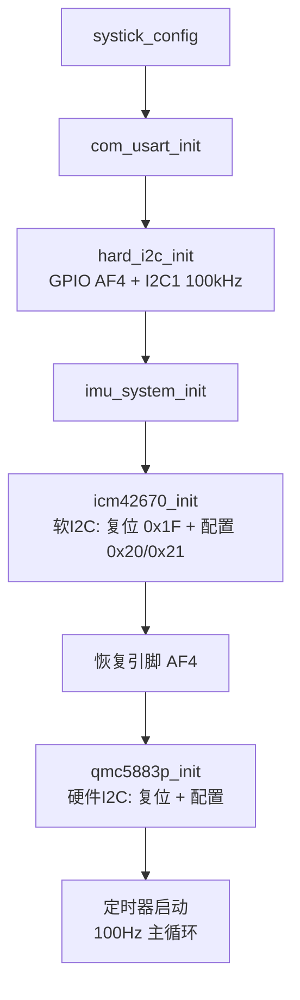
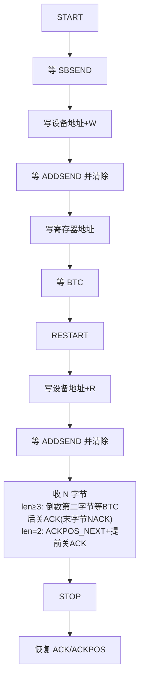

# GD32F330 硬件 I2C 调试总结

## 一、背景与结论

- 芯片：**GD32F330**，I2C1 引脚：**PA0 = I2C1_SCL、PA1 = I2C1_SDA（AF4）**。
- 目的：将原来"能跑但长时间会死机"的软 I2C 替换为硬件 I2C。
- **结论：硬件 I2C 已打通并验证**——扫描到 QMC5883P@0x2C、ICM42670@0x68，主循环 100Hz 稳定读数。

### 1.1 引脚与电气参数

| 项目 | 取值 | 说明 |
|---|---|---|
| I2C 外设 | **I2C1** | `HARD_I2C_PERIPH` |
| SCL | **PA0**（AF4） | `GPIO_AF_4` |
| SDA | **PA1**（AF4） | `GPIO_AF_4` |
| 速率 | **100kHz** 标准模式 | `HARD_I2C_SPEED`，与旧软 I2C 一致 |
| 输出模式 | 复用功能、开漏、上拉 | `GPIO_MODE_AF` + `GPIO_OTYPE_OD` |
| 地址格式 | 7bit | 设备地址：ICM42670=0x68、QMC5883P=0x2C |
| 超时计数 | `I2C_TIMEOUT = 10000` | 卡死时触发 `hard_i2c_bus_reset` 自恢复 |

> 注意：GD32 硬件 I2C 使用 **8 位地址**（7 位地址左移 1 位），与软 I2C 内部处理保持一致。

---

## 二、出现的问题、怀疑与解决方式

| # | 问题现象 | 怀疑方向 | 解决方式 |
|---|---|---|---|
| 1 | I2C1 引脚无反应：SCL/SDA 恒为高，外设内部状态正常（SB/MASTER 置位）但地址一个时钟都打不出 | 引脚复用 AF 配错：外设信号没接到引脚（固件库示例按 GD32F350 用 AF1，F330 不同） | 核对数据手册 AF 表：PA0/PA1 的 I2C1 是 **AF4**。`GPIO_AF_1` → `GPIO_AF_4` |
| 2 | 扫描时总线反复卡死、复位：START 后 SBSEND 永不置位、CTL0 残留 STOP(0x0701) | probe 对 NACK 处理错误：只等 ADDSEND 超时后未清 AERR 就发 STOP → STOP 不完成残留，污染下次 START | probe 同时等 ADDSEND\|AERR；NACK 分支先清 AERR/BERR/LOSTARB 再发 STOP；发完 STOP 确认位被清 |
| 3 | 多字节读必超时，单字节读正常 | `i2c_reg_read_multi` 的 ACK/STOP 时机不符合 GD32 主机接收时序 | 按官方示例重写：len≥3 倒数第二字节等 BTC 后关 ACK（末字节 NACK）、收完再发 STOP；len=2 用官方 two_bytes 时序；收尾恢复 ACKPOS/ACK |
| 4 | ICM42670 在扫描/单字节读时 NACK，数据读正常 | START 到写地址之间夹了 printf（SCL 被拉低几毫秒），ICM42670 对此敏感 | 所有 printf 挪到写地址之后，START→SB→写地址紧贴（QMC5883P 能容忍、ICM42670 不能） |
| 5 | ICM42670 初始化读 WHO_AM_I(0x75) 无限时钟拉伸卡死；软 I2C 能读(0x67) | 硬件 I2C 尊重从机时钟拉伸会一直等；软 I2C 用固定延时驱动 SCL 不受拉伸影响 | 初始化改用**软 I2C** 写配置寄存器（器件已验证 0x67），配完恢复 AF4；主循环数据读取仍用**硬件 I2C** |

> 排查关键点：从"外设内部正常但引脚没反应"反推 → 用寄存器读回（GPIO AF、STAT0/CTL0）和软/硬 I2C 对照测试，逐层定位。

### 2.1 排障方法学

1. **先确认外设内部状态**：读 `I2C_STAT0`，看 SB/MASTER/TRS 是否按预期置位——外设"认为"自己在工作但引脚没波形，说明**信号没接出去**（AF 错误、引脚被复用占用）。
2. **读回 GPIO AF 寄存器**：`GPIO_AFSEL0` 应为 `0x44`（PA0/PA1 都是 AF4）；读到 `0x11`（AF1）即可直接定位 AF 配错。
3. **软/硬 I2C 对照**：同一寄存器分别用软 I2C 与硬 I2C 读写，区分"器件问题"与"驱动时序问题"。
4. **每次卡死都 dump 现场**：`STAT0 / STAT1 / CTL0 / BUSY / SCL / SDA` 六项，用 probe 超时打印即可复现（见 3.8）。

---

## 三、当前 I2C 工作流程

### 3.1 上电初始化流程



### 3.2 硬件 I2C 多字节读（i2c_reg_read_multi）



### 3.3 主循环数据流（硬件 I2C）


### 3.4 驱动 API 速查表

| 函数 | 作用 | 关键实现 |
|---|---|---|
| `hard_i2c_init()` | 初始化 GPIO + I2C1 外设 | 配 AF4 → 配置时钟/ACK → 检查 BUSY，必要时总线复位 |
| `hard_i2c_bus_reset()` | 手动复位 I2C 总线 | GPIO 拉低 SCL/SDA → 9 个时钟脉冲 → 发 STOP → RCU 复位 I2C1 → 重新初始化 |
| `i2c_reg_write()` | 单寄存器写 | 状态机：START→地址(W)→寄存器→数据→STOP |
| `i2c_reg_read()` | 单寄存器读 | 状态机：START→地址(W)→寄存器→RESTART→地址(R)→读 1 字节→STOP |
| `i2c_reg_read_multi()` | 多字节连续读 | 见 3.7，按 len=1/2/N≥3 分三种时序 |
| `hard_i2c_probe()` | 探测设备在线 | START→地址(W)→等 ADDSEND(ACK)/AERR(NACK)，返回 0=在线 1=离线 |

所有读写函数均为**阻塞状态机 + 超时保护**，任何一步超时都会走 `hard_i2c_bus_reset()` 自恢复，避免总线卡死拖垮主循环。

### 3.5 状态机定义

```c
#define I2C_START            0
#define I2C_SEND_ADDRESS     1
#define I2C_CLEAR_ADDRESS_FLAG 2
#define I2C_TRANSMIT_DATA    3
#define I2C_RECEIVE_DATA     4
#define I2C_STOP             5
#define I2C_END              6
```

每次调用在一个 `while(!i2c_timeout_flag)` 大循环里按 `switch(state)` 推进，每一步都带 `I2C_TIMEOUT` 超时；超时则重置状态回 `I2C_START` 并做总线复位。

### 3.6 GD32 I2C 寄存器要点（与 STM32F1 的差异）

**I2C_CTL0 位定义**（GD32 与 STM32F1 不同，不能照搬）：

| 位 | 功能 | 说明 |
|---|---|---|
| bit8 | **START** | 发 START（写 1 触发） |
| bit9 | **STOP** | 发 STOP（写 1 触发，硬件完成后自动清 0） |
| bit10 | **ACKEN** | ACK 使能 |
| bit0 | **I2CEN** | I2C 外设使能 |

**关键标志**（`I2C_FLAG_xxx`，读 `STAT0/STAT1`）：

- `SBSEND`：START 已发送
- `ADDSEND`：地址已发送且**收到 ACK**
- `AERR`：地址**收到 NACK**（GD32 在 NACK 时只置 AERR、不置 ADDSEND——必须同时等两者）
- `BERR`：总线错误；`LOSTARB`：仲裁丢失
- `TBE` / `RBNE`：发送缓冲空 / 接收缓冲非空
- `BTC`：字节传输完成
- `I2CBSY`：总线忙

### 3.7 多字节读（read_multi）三种时序

`i2c_reg_read_multi(dev, reg, buf, len)` 按长度分三种走法，ACK/STOP 时机完全不同：

| len | 时序要点 |
|---|---|
| **1** | 写寄存器后 RESTART → 发读地址 → 清 ADDSEND 后**立即发 STOP** → 等 RBNE 读 1 字节 |
| **2** | START 前设 `ACKPOS_NEXT` → 发读地址后**关 ACK** → 等 BTC → 等 RBNE 连续读 2 字节 → STOP |
| **N≥3** | 倒数第二字节（index==len-2）等 BTC 后**关 ACK**（让最后一字节收到 NACK）→ 收完全部字节后才发 STOP |

> 收尾统一：STOP 完成后恢复 `ACKPOS_CURRENT` + `ACK_ENABLE`，供下一次传输使用。

### 3.8 probe 超时现场解读

`hard_i2c_probe` 超时打印的 6 项现场，按以下对照定位：

| 现场 | 含义 | 处理 |
|---|---|---|
| `AERR` 置位 | 设备 NACK（正常离线） | 清 AERR 后发 STOP 即可 |
| `LOSTARB` 置位 | 总线冲突（多主机/外部拉低） | 清标志后复位总线 |
| `BERR` 置位 | 总线错误（意外 START/STOP） | 清标志后复位总线 |
| `SCL=0` 卡低 | 时钟被拉伸卡死（上拉弱/器件拉低） | 总线复位释放 |
| `SDA=0` 卡低 | 有设备把 SDA 拉死 | 总线复位释放 |
| `BUSY=1` | 传输进行中但未完成 | 复位总线 |

---

## 四、调试开关

- `hard_i2c.c` 顶部 **`I2C_DEBUG_ENABLE`**：`0` 关闭本文件所有 I2C 调试打印（正式运行）；`1` 打开详细日志（调试）。实现方式为编译期 `#define printf(...)` 空化，零运行时开销。
- `main.c` 中的 I2C 总线扫描、开机 `[DIAG]` 软 I2C 诊断已注释（调试用）。
- `main.c` 的 `diag_*` 软 I2C 助手函数保留——`icm42670_init` 的软 I2C 初始化依赖它们。
- `hard_i2c.h` 的 **`I2C_TIMEOUT = 10000`**：曾尝试加大到 100000，反而让 ICM42670 时钟拉伸挂得更久——**保持小值 + 总线复位自恢复**才是正确方向。

## 五、硬件 vs 软件 I2C 分工

| 环节 | 用哪种 | 原因 |
|---|---|---|
| ICM42670 初始化（写配置寄存器） | **软 I2C** | 硬 I2C 读 0x75(WHO_AM_I) 会无限时钟拉伸卡死；软 I2C 固定延时驱动 SCL 不受拉伸影响（已验证 ID=0x67） |
| QMC5883P 初始化 | **硬件 I2C** | 正常 |
| 主循环 100Hz 数据读取（12/2/6 字节） | **硬件 I2C** | 稳定无超时，性能优于软 I2C |

> 软 I2C 由 `main.c` 里的 `diag_*` 助手函数实现（GPIO 开漏 + 位反转时序）；硬 I2C 由 `hard_i2c.c` 状态机实现。

## 六、关联问题排查（同项目，非 I2C）

### 6.1 串口 0x8E 心跳帧丢失

- **现象**：主循环同时 `proto_send(0x82)` 和 `proto_send(0x8E)`，只有 0x82 输出。
- **根因**：`proto_send()` 开头 `if (usart0_tx_busy) return;` 是**静默丢弃**而非等待；两帧背靠背调用时，0x82 刚启动 DMA（busy=1），0x8E 立即被丢弃。
- **解决**：两帧错开 500ms 发送（`debug_cnt % 1000 == 0` 发 0x82，`== 500` 发 0x8E）。

### 6.2 姿态 roll 长时间运行后跳 ±180°

- **现象**：静止运行数小时后 roll 突然涨到 ±180° 来回跳（yaw 恒定 → 非物理运动，纯滤波侧问题）。
- **根因链**：Mahony 交叉积误差 `e = a×v` 大小 `∝ sinθ`，在 0° 和 **180° 都是 0** → 180° 是"反演锁死"假平衡点；陀螺零偏/积分项累积到临界后越过 90° 稳定盆地，单向滑向 180° 锁死。
- **修复**：
  1. `euler_to_quat` 改为**标准 ZYX 约定**（原 q1/q2 反了，修正方向错误）；
  2. 反演检测：`v·a < 0` 且 `|a|≈1g` 时用加速度计重新初始化四元数（保持 yaw）；
  3. Mahony 积分项限幅 `I_LIMIT = 0.5`，防积分自激。
- 详见《姿态解算路径.MD》。

## 七、遗留备注

- 软 I2C 长时间运行死机问题**未排查**（与硬件 I2C 无关，如需处理可另行分析）。
- 硬 I2C 已知限制：ICM42670 的 `0x75(WHO_AM_I)` 寄存器**只能用软 I2C 读**（硬 I2C 时钟拉伸卡死），初始化后数据读取不受影响。
- 温度突变零偏跟踪：`attitude_calc_6axis` 阶段 7 通过温度变化检测触发快速零偏 EMA（fast_alpha=0.1）；`last_temp` 需在首次对准完成后初始化，避免上电误触发（已在代码注释中标注）。
