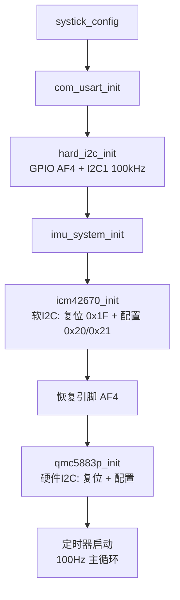
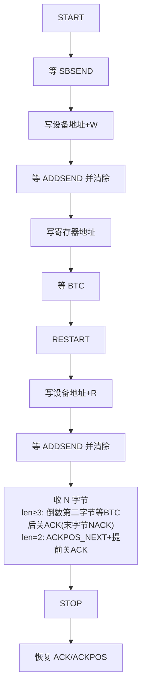

# GD32F330 硬件 I2C 调试总结

## 一、背景与结论

- 芯片：**GD32F330**，I2C1 引脚：**PA0 = I2C1_SCL、PA1 = I2C1_SDA（AF4）**。
- 目的：将原来"能跑但长时间会死机"的软 I2C 替换为硬件 I2C。
- **结论：硬件 I2C 已打通并验证**——扫描到 QMC5883P@0x2C、ICM42670@0x68，主循环 100Hz 稳定读数。

---

## 二、出现的问题、怀疑与解决方式

| # | 问题现象 | 怀疑方向 | 解决方式 |
|---|---|---|---|
| 1 | I2C1 引脚无反应：SCL/SDA 恒为高，外设内部状态正常（SB/MASTER 置位）但地址一个时钟都打不出 | 引脚复用 AF 配错：外设信号没接到引脚（固件库示例按 GD32F350 用 AF1，F330 不同） | 核对数据手册 AF 表：PA0/PA1 的 I2C1 是 **AF4**。`GPIO_AF_1` → `GPIO_AF_4` |
| 2 | 扫描时总线反复卡死、复位：START 后 SBSEND 永不置位、CTL0 残留 STOP(0x0701) | probe 对 NACK 处理错误：只等 ADDSEND 超时后未清 AERR 就发 STOP → STOP 不完成残留，污染下次 START | probe 同时等 ADDSEND\|AERR；NACK 分支先清 AERR/BERR/LOSTARB 再发 STOP；发完 STOP 确认位被清 |
| 3 | 多字节读必超时，单字节读正常 | `i2c_reg_read_multi` 的 ACK/STOP 时机不符合 GD32 主机接收时序 | 按官方示例重写：len≥3 倒数第二字节等 BTC 后关 ACK（末字节 NACK）、收完再发 STOP；len=2 用官方 two_bytes 时序；收尾恢复 ACKPOS/ACK |
| 4 | ICM42670 在扫描/单字节读时 NACK，数据读正常 | START 到写地址之间夹了 printf（SCL 被拉低几毫秒），ICM42670 对此敏感 | 所有 printf 挪到写地址之后，START→SB→写地址紧贴（QMC5883P 能容忍、ICM42670 不能） |
| 5 | ICM42670 初始化读 WHO_AM_I(0x75) 无限时钟拉伸卡死；软 I2C 能读(0x67) | 硬件 I2C 尊重从机时钟拉伸会一直等；软 I2C 用固定延时驱动 SCL 不受拉伸影响 | 初始化改用**软 I2C** 写配置寄存器（器件已验证 0x67），配完恢复 AF4；主循环数据读取仍用**硬件 I2C** |

> 排查关键点：从"外设内部正常但引脚没反应"反推 → 用寄存器读回（GPIO AF、STAT0/CTL0）和软/硬 I2C 对照测试，逐层定位。

---

## 三、当前 I2C 工作流程

### 3.1 上电初始化流程

### 3.2 硬件 I2C 多字节读（i2c_reg_read_multi）

### 3.3 主循环数据流（硬件 I2C）

---

## 四、调试开关

- `hard_i2c.c` 顶部 **`I2C_DEBUG_ENABLE`**：`0` 关闭本文件所有 I2C 调试打印（正式运行）；`1` 打开详细日志（调试）。
- `main.c` 中的 I2C 总线扫描、开机 `[DIAG]` 软 I2C 诊断已注释（调试用）。
- `main.c` 的 `diag_*` 软 I2C 助手函数保留——`icm42670_init` 的软 I2C 初始化依赖它们。

## 五、遗留备注

- 软 I2C 长时间运行死机问题**未排查**（与硬件 I2C 无关，如需处理可另行分析）。
